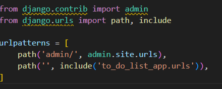

# Django

## Create and activate a Python Virtual Environment in Windows
 
 - python -m venv <vm-name>
 - .\<vm-name>\Scripts\activate.bat

### Check the installtion is successfull py typing the command slmgr /xpr

 - You’ll get one of the following messages:
  - ✅ “This machine is permanently activated” → Windows is activated.

### Command to install django
 - pip install django

### Check installed version of django
 - django-admin --version

### Command to start a new Djang 
 - django-admin startproject <project_name>. (Avoid using - inside project name)

### Command to starts the Django development web server
 - python .\manage.py runserver

### Command to create a new app inside your project 
 - python manage.py startapp <new-app-name>

### Before starting to work on the new app follow : 
 - copy the url.py from the main project to the newely created app folder
 - update the url.py to include the import of 'include' and update the 
  - eg: 
        

